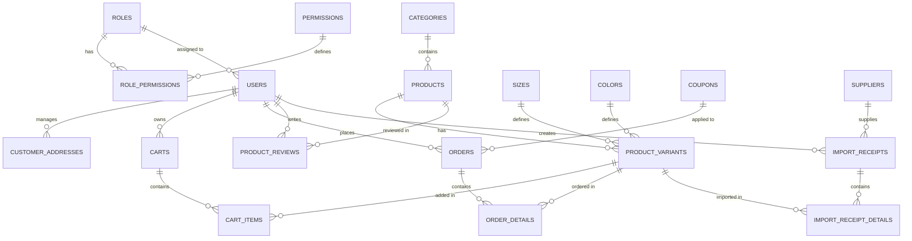

# BÁO CÁO ĐỒ ÁN MÔN HỌC: LẬP TRÌNH WEB
**TRƯỜNG ĐẠI HỌC CÔNG THƯƠNG THÀNH PHỐ HỒ CHÍ MINH (HUIT)**  
**ĐỀ TÀI: WEBSITE QUẢN LÝ VÀ KINH DOANH MẶT HÀNG QUẦN ÁO**  
*Người thực hiện: Thành viên số 1 (Phụ trách Database & Backend Nền tảng)*

---

# CHƯƠNG 2: PHÂN TÍCH VÀ THIẾT KẾ HỆ THỐNG

## 2.1. Sơ đồ Use Case (UML Use Case)

Hệ thống Website Quản lý & Kinh doanh Mặt hàng Quần áo phục vụ 3 nhóm tác nhân chính:

1. **Quản trị viên (Admin):**  
   Toàn quyền quản trị hệ thống:
   - Quản lý tài khoản người dùng và phân quyền chi tiết (RBAC).
   - Quản lý danh mục và toàn bộ danh sách sản phẩm, biến thể (Size/Màu).
   - Duyệt và cập nhật trạng thái đơn đặt hàng (Chờ xác nhận, Đang giao, Đã giao, Hủy).
   - Quản lý nhập xuất kho hàng và đối tác nhà cung cấp.
   - Thiết lập các chương trình khuyến mãi, mã giảm giá (`Coupons`).
   - Xem Bảng điều khiển (Dashboard) và báo cáo thống kê doanh thu đa chiều thời gian thực.

2. **Nhân viên (Staff / Quản lý kho):**  
   - Quản lý kho: kiểm tra tồn kho theo kích cỡ, màu sắc; lập phiếu nhập hàng từ nhà cung cấp.
   - Quản lý đơn hàng: theo dõi đơn mới, cập nhật trạng thái đơn hàng.

3. **Khách hàng (Customer):**  
   - Xem danh sách sản phẩm, tìm kiếm và lọc theo danh mục, giá bán.
   - Xem chi tiết sản phẩm kèm kích cỡ (Size), màu sắc (Color) và số lượng tồn kho còn lại.
   - Đăng ký / Đăng nhập tài khoản, quản lý sổ địa chỉ nhận hàng (`CustomerAddresses`).
   - Thêm sản phẩm vào giỏ hàng (lưu CSDL và Session), cập nhật số lượng, xóa khỏi giỏ.
   - Áp dụng mã giảm giá voucher khuyến mãi (`Coupons`) khi đặt mua hàng.
   - Gửi đánh giá sao (1-5 sao) và nhận xét về sản phẩm (`ProductReviews`).

```mermaid
graph TD
    User((Khách hàng))
    Admin((Quản trị viên))
    Staff((Nhân viên kho))

    subgraph "Hệ Thống Website Quần Áo"
        UC1[Đăng ký / Đăng nhập]
        UC2[Xem & Tìm kiếm sản phẩm]
        UC3[Xem chi tiết Size / Màu / Tồn kho]
        UC4[Giỏ hàng & Áp mã Voucher]
        UC5[Đặt hàng trực tuyến & Sổ địa chỉ]
        UC6[Đánh giá & Bình luận sản phẩm]
        UC7[Quản lý Sản phẩm & Danh mục]
        UC8[Quản lý Kho & Phiếu nhập hàng]
        UC9[Quản lý Đơn hàng & Giao vận]
        UC10[Phân quyền RBAC & Quản lý User]
        UC11[Quản lý Mã giảm giá Coupons]
        UC12[Xem Dashboard & Báo cáo Doanh thu]
    end

    User --> UC1
    User --> UC2
    User --> UC3
    User --> UC4
    User --> UC5
    User --> UC6

    Admin --> UC1
    Admin --> UC7
    Admin --> UC8
    Admin --> UC9
    Admin --> UC10
    Admin --> UC11
    Admin --> UC12

    Staff --> UC1
    Staff --> UC7
    Staff --> UC8
    Staff --> UC9
```

---

## 2.2. Thiết kế Cơ sở Dữ liệu (ERD)

Cơ sở dữ liệu của hệ thống được đặt tên là `WebQuanLyQuanAoDb`, được thiết kế và chuẩn hóa 3NF trên hệ quản trị Microsoft SQL Server 2019/2022 gồm **19 bảng** phân bổ thành 5 phân hệ rõ ràng:

---

## 2.3. Mô tả chi tiết các bảng dữ liệu

### A. Phân hệ Phân quyền & Quản lý Người dùng (RBAC)

#### Bảng 2.1: `Roles` (Vai trò người dùng)
| Tên trường | Kiểu dữ liệu | Khóa | Null | Mô tả |
| :--- | :--- | :--- | :--- | :--- |
| `RoleId` | INT IDENTITY(1,1) | PK | NO | Mã vai trò (Khóa chính, tự tăng) |
| `RoleName` | NVARCHAR(50) | UNIQUE | NO | Tên vai trò (Admin, Staff, Customer) |
| `Description` | NVARCHAR(255) | | YES | Mô tả quyền hạn |

#### Bảng 2.2: `Permissions` (Danh mục quyền chức năng)
| Tên trường | Kiểu dữ liệu | Khóa | Null | Mô tả |
| :--- | :--- | :--- | :--- | :--- |
| `PermissionId` | INT IDENTITY(1,1) | PK | NO | Mã quyền (Khóa chính, tự tăng) |
| `PermissionName`| NVARCHAR(100) | | NO | Tên hiển thị quyền |
| `PermissionCode`| VARCHAR(50) | UNIQUE | NO | Mã code quyền (VD: `PRODUCT_MANAGE`, `ORDER_MANAGE`) |
| `Module` | NVARCHAR(50) | | NO | Phân hệ thuộc về (Sản phẩm, Đơn hàng, Kho, Tài khoản, Báo cáo) |
| `Description` | NVARCHAR(255) | | YES | Mô tả chi tiết quyền |

#### Bảng 2.3: `RolePermissions` (Gán quyền cho vai trò)
| Tên trường | Kiểu dữ liệu | Khóa | Null | Mô tả |
| :--- | :--- | :--- | :--- | :--- |
| `RolePermissionId`| INT IDENTITY(1,1) | PK | NO | Mã gán quyền (Khóa chính, tự tăng) |
| `RoleId` | INT | FK | NO | Khóa ngoại tham chiếu `Roles(RoleId)` |
| `PermissionId` | INT | FK | NO | Khóa ngoại tham chiếu `Permissions(PermissionId)` |

#### Bảng 2.4: `Users` (Tài khoản người dùng)
| Tên trường | Kiểu dữ liệu | Khóa | Null | Mô tả |
| :--- | :--- | :--- | :--- | :--- |
| `UserId` | INT IDENTITY(1,1) | PK | NO | Mã người dùng (Khóa chính, tự tăng) |
| `Username` | VARCHAR(50) | UNIQUE | NO | Tên đăng nhập duy nhất vào hệ thống |
| `PasswordHash` | VARCHAR(255) | | NO | Mật khẩu tài khoản |
| `FullName` | NVARCHAR(100) | | NO | Họ và tên đầy đủ |
| `Email` | VARCHAR(100) | | YES | Địa chỉ Email |
| `PhoneNumber` | VARCHAR(20) | | YES | Số điện thoại liên lạc |
| `Address` | NVARCHAR(255) | | YES | Địa chỉ liên hệ |
| `Avatar` | VARCHAR(255) | | YES | Đường dẫn ảnh đại diện |
| `RoleId` | INT | FK | NO | Khóa ngoại tham chiếu `Roles(RoleId)` |
| `IsActive` | BIT | | NO | Trạng thái (1: Hoạt động, 0: Khóa) |
| `CreatedAt` | DATETIME | | NO | Thời điểm tạo tài khoản (GETDATE()) |

#### Bảng 2.5: `CustomerAddresses` (Sổ địa chỉ giao hàng của khách)
| Tên trường | Kiểu dữ liệu | Khóa | Null | Mô tả |
| :--- | :--- | :--- | :--- | :--- |
| `AddressId` | INT IDENTITY(1,1) | PK | NO | Mã địa chỉ (Khóa chính, tự tăng) |
| `UserId` | INT | FK | NO | Khóa ngoại tham chiếu `Users(UserId)` |
| `ReceiverName` | NVARCHAR(100) | | NO | Họ tên người nhận tại địa chỉ này |
| `PhoneNumber` | VARCHAR(20) | | NO | Số điện thoại người nhận |
| `SpecificAddress`| NVARCHAR(255) | | NO | Địa chỉ chi tiết (số nhà, tên đường, phường/xã) |
| `City` | NVARCHAR(100) | | YES | Tỉnh / Thành phố |
| `IsDefault` | BIT | | NO | Địa chỉ mặc định (1: Mặc định, 0: Phụ) |

---

### B. Phân hệ Danh mục, Sản phẩm & Biến thể Quần áo

#### Bảng 2.6: `Categories` (Danh mục sản phẩm quần áo)
| Tên trường | Kiểu dữ liệu | Khóa | Null | Mô tả |
| :--- | :--- | :--- | :--- | :--- |
| `CategoryId` | INT IDENTITY(1,1) | PK | NO | Mã danh mục (Khóa chính, tự tăng) |
| `CategoryName` | NVARCHAR(100) | | NO | Tên phân loại (Áo thun, Sơ mi, Quần Jean...) |
| `Slug` | VARCHAR(100) | | YES | Định danh thân thiện URL phục vụ SEO |
| `Description` | NVARCHAR(500) | | YES | Mô tả ngắn về nhóm trang phục |
| `ImageUrl` | VARCHAR(255) | | YES | Hình ảnh minh họa danh mục |
| `DisplayOrder` | INT | | NO | Thứ tự sắp xếp trên Menu |
| `IsActive` | BIT | | NO | Trạng thái hiển thị (1: Hiện, 0: Ẩn) |

#### Bảng 2.7: `Products` (Mặt hàng quần áo)
| Tên trường | Kiểu dữ liệu | Khóa | Null | Mô tả |
| :--- | :--- | :--- | :--- | :--- |
| `ProductId` | INT IDENTITY(1,1) | PK | NO | Mã sản phẩm (Khóa chính, tự tăng) |
| `CategoryId` | INT | FK | NO | Khóa ngoại tham chiếu `Categories(CategoryId)` |
| `ProductName` | NVARCHAR(200) | | NO | Tên mặt hàng quần áo |
| `ProductCode` | VARCHAR(50) | UNIQUE | YES | Mã kiểu dáng (VD: AT-001) |
| `Description` | NVARCHAR(MAX) | | YES | Mô tả chất liệu vải, form dáng, cách giặt |
| `OriginalPrice` | DECIMAL(18,2) | | NO | Giá vốn / Giá nhập hàng |
| `Price` | DECIMAL(18,2) | | NO | Giá bán niêm yết chính thức |
| `DiscountPercent`| INT | | YES | % Giảm giá khuyến mãi |
| `MainImage` | VARCHAR(255) | | YES | Ảnh đại diện chính của sản phẩm |
| `IsFeatured` | BIT | | NO | Sản phẩm nổi bật trang chủ (1: Có) |
| `IsActive` | BIT | | NO | Trạng thái kinh doanh (1: Đang bán, 0: Ngừng) |
| `CreatedAt` | DATETIME | | NO | Ngày thêm sản phẩm vào hệ thống |

#### Bảng 2.8: `Sizes` (Kích cỡ quần áo)
| Tên trường | Kiểu dữ liệu | Khóa | Null | Mô tả |
| :--- | :--- | :--- | :--- | :--- |
| `SizeId` | INT IDENTITY(1,1) | PK | NO | Mã kích cỡ (Khóa chính, tự tăng) |
| `SizeName` | VARCHAR(20) | UNIQUE | NO | Tên size (S, M, L, XL, XXL, 29, 30...) |
| `Description` | NVARCHAR(100) | | YES | Gợi ý cân nặng, chiều cao tương ứng |

#### Bảng 2.9: `Colors` (Màu sắc sản phẩm)
| Tên trường | Kiểu dữ liệu | Khóa | Null | Mô tả |
| :--- | :--- | :--- | :--- | :--- |
| `ColorId` | INT IDENTITY(1,1) | PK | NO | Mã màu (Khóa chính, tự tăng) |
| `ColorName` | NVARCHAR(50) | UNIQUE | NO | Tên màu sắc (Đen, Trắng, Xanh Navy...) |
| `ColorHex` | VARCHAR(10) | | YES | Mã màu HEX phục vụ giao diện (#000000) |

#### Bảng 2.10: `ProductVariants` (Biến thể sản phẩm & Tồn kho thực tế)
| Tên trường | Kiểu dữ liệu | Khóa | Null | Mô tả |
| :--- | :--- | :--- | :--- | :--- |
| `VariantId` | INT IDENTITY(1,1) | PK | NO | Mã biến thể (Khóa chính, tự tăng) |
| `ProductId` | INT | FK | NO | Khóa ngoại tham chiếu `Products(ProductId)` |
| `SizeId` | INT | FK | NO | Khóa ngoại tham chiếu `Sizes(SizeId)` |
| `ColorId` | INT | FK | NO | Khóa ngoại tham chiếu `Colors(ColorId)` |
| `SKU` | VARCHAR(50) | UNIQUE | YES | Mã định danh quản lý kho (SKU) |
| `StockQuantity` | INT | | NO | Số lượng tồn kho thực tế của biến thể |
| `VariantImage` | VARCHAR(255) | | YES | Ảnh riêng cho biến thể màu sắc |

---

### C. Phân hệ Giỏ hàng, Khuyến mãi & Đơn Đặt Hàng

#### Bảng 2.11: `Carts` (Giỏ hàng người dùng)
| Tên trường | Kiểu dữ liệu | Khóa | Null | Mô tả |
| :--- | :--- | :--- | :--- | :--- |
| `CartId` | INT IDENTITY(1,1) | PK | NO | Mã giỏ hàng (Khóa chính, tự tăng) |
| `UserId` | INT | FK | YES | Khóa ngoại tham chiếu `Users(UserId)` (NULL nếu vãng lai) |
| `SessionId` | VARCHAR(100) | | YES | Mã Session lưu giỏ tạm cho khách chưa đăng nhập |
| `CreatedAt` | DATETIME | | NO | Thời điểm tạo giỏ hàng |
| `UpdatedAt` | DATETIME | | NO | Thời điểm cập nhật giỏ gần nhất |

#### Bảng 2.12: `CartItems` (Chi tiết giỏ hàng)
| Tên trường | Kiểu dữ liệu | Khóa | Null | Mô tả |
| :--- | :--- | :--- | :--- | :--- |
| `CartItemId` | INT IDENTITY(1,1) | PK | NO | Mã chi tiết giỏ (Khóa chính, tự tăng) |
| `CartId` | INT | FK | NO | Khóa ngoại tham chiếu `Carts(CartId)` |
| `VariantId` | INT | FK | NO | Khóa ngoại tham chiếu `ProductVariants(VariantId)` |
| `Quantity` | INT | | NO | Số lượng chọn mua (CHECK > 0) |
| `AddedAt` | DATETIME | | NO | Thời điểm thêm sản phẩm vào giỏ |

#### Bảng 2.13: `Coupons` (Mã giảm giá khuyến mãi / Voucher)
| Tên trường | Kiểu dữ liệu | Khóa | Null | Mô tả |
| :--- | :--- | :--- | :--- | :--- |
| `CouponId` | INT IDENTITY(1,1) | PK | NO | Mã voucher (Khóa chính, tự tăng) |
| `CouponCode` | VARCHAR(50) | UNIQUE | NO | Mã khuyến mãi (VD: `HUIT2026`, `FREESHIP`) |
| `DiscountPercent`| INT | | YES | % Giảm giá trên đơn |
| `DiscountAmount` | DECIMAL(18,2) | | YES | Số tiền giảm trực tiếp (VNĐ) |
| `MinOrderAmount` | DECIMAL(18,2) | | NO | Giá trị đơn hàng tối thiểu để áp dụng |
| `StartDate` | DATETIME | | NO | Ngày bắt đầu hiệu lực |
| `EndDate` | DATETIME | | NO | Ngày hết hạn sử dụng |
| `UsageLimit` | INT | | NO | Số lượt sử dụng tối đa |
| `UsedCount` | INT | | NO | Số lượt đã áp dụng |
| `IsActive` | BIT | | NO | Trạng thái hoạt động (1: Kích hoạt, 0: Tắt) |

#### Bảng 2.14: `Orders` (Đơn đặt hàng)
| Tên trường | Kiểu dữ liệu | Khóa | Null | Mô tả |
| :--- | :--- | :--- | :--- | :--- |
| `OrderId` | INT IDENTITY(1,1) | PK | NO | Mã đơn hàng (Khóa chính, tự tăng) |
| `UserId` | INT | FK | YES | Khóa ngoại tham chiếu `Users(UserId)` |
| `CouponId` | INT | FK | YES | Khóa ngoại tham chiếu `Coupons(CouponId)` |
| `OrderDate` | DATETIME | | NO | Thời điểm đặt mua (GETDATE()) |
| `ReceiverName` | NVARCHAR(100) | | NO | Họ tên người nhận hàng |
| `ReceiverPhone` | VARCHAR(20) | | NO | Số điện thoại nhận hàng |
| `ShippingAddress`| NVARCHAR(255) | | NO | Địa chỉ giao hàng tận nơi |
| `OrderNotes` | NVARCHAR(500) | | YES | Ghi chú đơn hàng |
| `TotalAmount` | DECIMAL(18,2) | | NO | Tổng tiền thanh toán của đơn sau giảm giá |
| `DiscountAmount`| DECIMAL(18,2) | | NO | Số tiền được giảm từ voucher |
| `PaymentMethod` | NVARCHAR(50) | | NO | Hình thức thanh toán (COD, Chuyển khoản...) |
| `PaymentStatus` | NVARCHAR(50) | | NO | Trạng thái thanh toán |
| `OrderStatus` | NVARCHAR(50) | | NO | Trạng thái đơn (Chờ xác nhận, Đang giao, Đã giao, Hủy) |

#### Bảng 2.15: `OrderDetails` (Chi tiết đơn hàng)
| Tên trường | Kiểu dữ liệu | Khóa | Null | Mô tả |
| :--- | :--- | :--- | :--- | :--- |
| `OrderDetailId` | INT IDENTITY(1,1) | PK | NO | Mã chi tiết đơn (Khóa chính, tự tăng) |
| `OrderId` | INT | FK | NO | Khóa ngoại tham chiếu `Orders(OrderId)` |
| `VariantId` | INT | FK | NO | Khóa ngoại tham chiếu `ProductVariants(VariantId)` |
| `Quantity` | INT | | NO | Số lượng mặt hàng mua (CHECK > 0) |
| `UnitPrice` | DECIMAL(18,2) | | NO | Đơn giá tại thời điểm đặt hàng |
| `TotalPrice` | DECIMAL(18,2) | | NO | Thành tiền tự động tính (`Quantity * UnitPrice`) |

---

### D. Phân hệ Đánh giá Sản phẩm

#### Bảng 2.16: `ProductReviews` (Đánh giá & Bình luận sản phẩm)
| Tên trường | Kiểu dữ liệu | Khóa | Null | Mô tả |
| :--- | :--- | :--- | :--- | :--- |
| `ReviewId` | INT IDENTITY(1,1) | PK | NO | Mã đánh giá (Khóa chính, tự tăng) |
| `ProductId` | INT | FK | NO | Khóa ngoại tham chiếu `Products(ProductId)` |
| `UserId` | INT | FK | NO | Khóa ngoại tham chiếu `Users(UserId)` |
| `Rating` | INT | | NO | Điểm số sao đánh giá (1 đến 5 sao) |
| `Comment` | NVARCHAR(1000)| | YES | Nội dung nhận xét của khách hàng |
| `CreatedAt` | DATETIME | | NO | Thời điểm gửi đánh giá |
| `IsApproved` | BIT | | NO | Trạng thái kiểm duyệt (1: Đã duyệt) |

---

### E. Phân hệ Quản lý Nhà Cung Cấp & Nhập Kho

#### Bảng 2.17: `Suppliers` (Nhà cung cấp / Xưởng may)
| Tên trường | Kiểu dữ liệu | Khóa | Null | Mô tả |
| :--- | :--- | :--- | :--- | :--- |
| `SupplierId` | INT IDENTITY(1,1) | PK | NO | Mã nhà cung cấp (Khóa chính, tự tăng) |
| `SupplierName` | NVARCHAR(150) | | NO | Tên đơn vị cung cấp / xưởng may |
| `Phone` | VARCHAR(20) | | YES | Số điện thoại liên hệ |
| `Email` | VARCHAR(100) | | YES | Email liên hệ |
| `Address` | NVARCHAR(255) | | YES | Địa chỉ xưởng / văn phòng nhà cung cấp |

#### Bảng 2.18: `ImportReceipts` (Phiếu nhập kho)
| Tên trường | Kiểu dữ liệu | Khóa | Null | Mô tả |
| :--- | :--- | :--- | :--- | :--- |
| `ImportId` | INT IDENTITY(1,1) | PK | NO | Mã phiếu nhập kho (Khóa chính, tự tăng) |
| `SupplierId` | INT | FK | NO | Khóa ngoại tham chiếu `Suppliers(SupplierId)` |
| `UserId` | INT | FK | NO | Nhân viên lập phiếu nhập (Users) |
| `ImportDate` | DATETIME | | NO | Thời điểm nhập hàng |
| `TotalAmount` | DECIMAL(18,2) | | NO | Tổng giá trị lô hàng nhập |
| `Notes` | NVARCHAR(500) | | YES | Ghi chú kiểm kho |

#### Bảng 2.19: `ImportReceiptDetails` (Chi tiết phiếu nhập kho)
| Tên trường | Kiểu dữ liệu | Khóa | Null | Mô tả |
| :--- | :--- | :--- | :--- | :--- |
| `ImportDetailId`| INT IDENTITY(1,1) | PK | NO | Mã chi tiết phiếu nhập (Khóa chính, tự tăng) |
| `ImportId` | INT | FK | NO | Khóa ngoại tham chiếu `ImportReceipts(ImportId)` |
| `VariantId` | INT | FK | NO | Khóa ngoại tham chiếu `ProductVariants(VariantId)` |
| `Quantity` | INT | | NO | Số lượng mặt hàng nhập về kho (CHECK > 0) |
| `ImportPrice` | DECIMAL(18,2) | | NO | Đơn giá nhập hàng từ nhà cung cấp |
| `TotalPrice` | DECIMAL(18,2) | | NO | Thành tiền tự động tính (`Quantity * ImportPrice`) |
