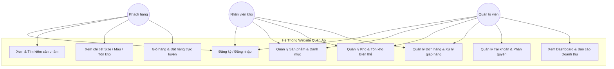
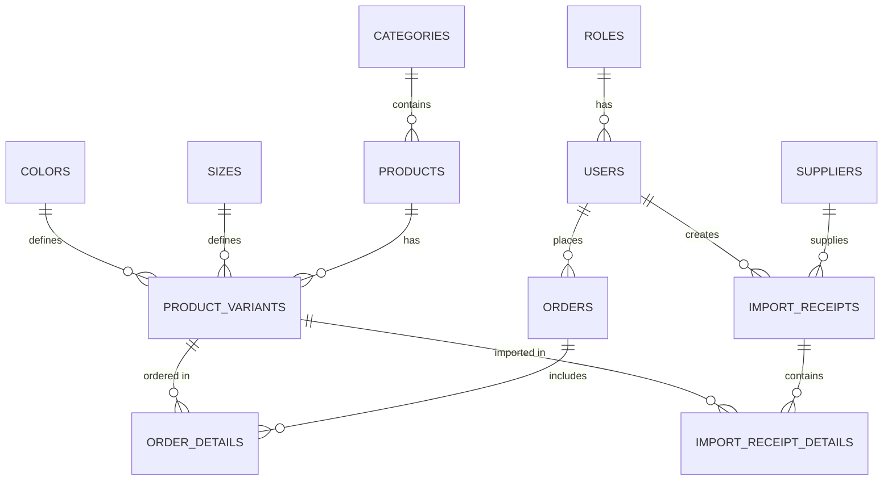

# BÁO CÁO ĐỒ ÁN MÔN HỌC: LẬP TRÌNH WEB
**TRƯỜNG ĐẠI HỌC CÔNG THƯƠNG THÀNH PHỐ HỒ CHÍ MINH (HUIT)**  
**ĐỀ TÀI: WEBSITE QUẢN LÝ VÀ KINH DOANH MẶT HÀNG QUẦN ÁO**  
*Người thực hiện: Thành viên số 1 (Phụ trách Database & Backend)*

---

# CHƯƠNG 2: PHÂN TÍCH VÀ THIẾT KẾ HỆ THỐNG

## 2.1. Sơ đồ Use Case (UML Use Case)

Hệ thống Website Quản lý & Kinh doanh Mặt hàng Quần áo được xây dựng phục vụ ba đối tượng tác nhân (Actors) chính với các quyền hạn và vai trò rõ ràng:

1. **Quản trị viên (Admin):**  
   Toàn quyền quản trị hệ thống:
   - Quản lý người dùng và phân quyền hệ thống.
   - Quản lý danh mục và toàn bộ danh sách sản phẩm.
   - Duyệt và cập nhật trạng thái đơn đặt hàng.
   - Quản lý nhập xuất kho hàng.
   - Xem Bảng điều khiển (Dashboard) và báo cáo thống kê doanh thu đa chiều theo thời gian thực.

2. **Nhân viên (Staff / Quản lý kho):**  
   - Thực hiện các nghiệp vụ quản lý kho (kiểm tra tồn kho theo kích cỡ, màu sắc, lập phiếu nhập hàng từ nhà cung cấp).
   - Theo dõi và cập nhật trạng thái đơn hàng (Chờ xác nhận $\rightarrow$ Đang giao $\rightarrow$ Đã hoàn thành).

3. **Khách hàng (Customer):**  
   - Xem danh sách danh mục và sản phẩm mới nhất.
   - Tìm kiếm và lọc sản phẩm theo từ khóa, mức giá, danh mục.
   - Xem chi tiết sản phẩm kèm kích cỡ (Size), màu sắc (Color) và số lượng tồn kho còn lại.
   - Đăng ký tài khoản, đăng nhập hệ thống.
   - Thêm sản phẩm vào giỏ hàng (lưu bằng Session) và tiến hành đặt mua hàng trực tuyến.

---

## 2.2. Thiết kế Cơ sở Dữ liệu (ERD)

Cơ sở dữ liệu của hệ thống được đặt tên là `WebQuanLyQuanAoDb`, được chuẩn hóa 3NF trên Microsoft SQL Server 2019/2022. Thiết kế chú trọng giải quyết bài toán đặc thù của ngành thời trang: mỗi sản phẩm có nhiều Kích cỡ (`Sizes`) và Màu sắc (`Colors`). Thực thể liên kết `ProductVariants` được sử dụng để theo dõi tồn kho và liên kết trực tiếp với chi tiết đơn hàng `OrderDetails`.

### Các mối quan hệ thực thể chính:
- **`Roles - Users` (1 - N):** Một quyền có nhiều người dùng.
- **`Categories - Products` (1 - N):** Một danh mục chứa nhiều sản phẩm.
- **`Products, Sizes, Colors - ProductVariants` (1 - N):** Một sản phẩm có nhiều biến thể theo kích cỡ và màu sắc tương ứng.
- **`Users - Orders` (1 - N):** Một người dùng có thể đặt nhiều đơn hàng.
- **`Orders, ProductVariants - OrderDetails` (1 - N):** Một đơn hàng chứa nhiều chi tiết mặt hàng biến thể.
- **`Suppliers, Users - ImportReceipts` (1 - N):** Một nhà cung cấp có nhiều phiếu nhập hàng do nhân viên tạo.
- **`ImportReceipts, ProductVariants - ImportReceiptDetails` (1 - N):** Chi tiết các biến thể nhập về kho.

---

## 2.3. Mô tả chi tiết các bảng dữ liệu

### Bảng 2.1: `Roles` (Phân quyền người dùng)
| Tên trường (Column) | Kiểu dữ liệu (Type) | Khóa (Key) | Cho phép NULL | Mô tả (Description) |
| :--- | :--- | :--- | :--- | :--- |
| `RoleId` | INT IDENTITY(1,1) | PK | NO | Mã vai trò (Khóa chính, tự tăng) |
| `RoleName` | NVARCHAR(50) | UNIQUE | NO | Tên vai trò (Admin, Staff, Customer) |
| `Description` | NVARCHAR(255) | | YES | Mô tả phạm vi quyền hạn |

### Bảng 2.2: `Users` (Tài khoản người dùng)
| Tên trường (Column) | Kiểu dữ liệu (Type) | Khóa (Key) | Cho phép NULL | Mô tả (Description) |
| :--- | :--- | :--- | :--- | :--- |
| `UserId` | INT IDENTITY(1,1) | PK | NO | Mã người dùng (Khóa chính, tự tăng) |
| `Username` | VARCHAR(50) | UNIQUE | NO | Tên đăng nhập hệ thống |
| `PasswordHash` | VARCHAR(255) | | NO | Mật khẩu tài khoản |
| `FullName` | NVARCHAR(100) | | NO | Họ và tên đầy đủ |
| `Email` | VARCHAR(100) | | YES | Địa chỉ Email |
| `PhoneNumber` | VARCHAR(20) | | YES | Số điện thoại liên lạc |
| `Address` | NVARCHAR(255) | | YES | Địa chỉ mặc định |
| `Avatar` | VARCHAR(255) | | YES | Đường dẫn ảnh đại diện |
| `RoleId` | INT | FK | NO | Khóa ngoại tham chiếu `Roles(RoleId)` |
| `IsActive` | BIT | | NO | Trạng thái (1: Hoạt động, 0: Khóa) |
| `CreatedAt` | DATETIME | | NO | Thời điểm tạo tài khoản (GETDATE()) |

### Bảng 2.3: `Categories` (Danh mục sản phẩm quần áo)
| Tên trường (Column) | Kiểu dữ liệu (Type) | Khóa (Key) | Cho phép NULL | Mô tả (Description) |
| :--- | :--- | :--- | :--- | :--- |
| `CategoryId` | INT IDENTITY(1,1) | PK | NO | Mã danh mục (Khóa chính, tự tăng) |
| `CategoryName` | NVARCHAR(100) | | NO | Tên danh mục (Áo thun, Sơ mi, Quần Jean...) |
| `Slug` | VARCHAR(100) | | YES | Định danh đường dẫn thân thiện URL SEO |
| `Description` | NVARCHAR(500) | | YES | Mô tả về danh mục |
| `ImageUrl` | VARCHAR(255) | | YES | Hình ảnh minh họa danh mục |
| `DisplayOrder` | INT | | NO | Thứ tự hiển thị trên Menu (Mặc định: 0) |
| `IsActive` | BIT | | NO | Trạng thái hiển thị (1: Hiện, 0: Ẩn) |

### Bảng 2.4: `Products` (Mặt hàng quần áo)
| Tên trường (Column) | Kiểu dữ liệu (Type) | Khóa (Key) | Cho phép NULL | Mô tả (Description) |
| :--- | :--- | :--- | :--- | :--- |
| `ProductId` | INT IDENTITY(1,1) | PK | NO | Mã sản phẩm (Khóa chính, tự tăng) |
| `CategoryId` | INT | FK | NO | Khóa ngoại tham chiếu `Categories(CategoryId)` |
| `ProductName` | NVARCHAR(200) | | NO | Tên sản phẩm thời trang |
| `ProductCode` | VARCHAR(50) | UNIQUE | YES | Mã kiểu dáng (VD: AT-001, QJ-002) |
| `Description` | NVARCHAR(MAX) | | YES | Mô tả chất liệu vải, form dáng, cách giặt |
| `OriginalPrice` | DECIMAL(18,2) | | NO | Giá vốn / Giá nhập hàng |
| `Price` | DECIMAL(18,2) | | NO | Giá bán niêm yết |
| `DiscountPercent`| INT | | YES | % Giảm giá khuyến mãi |
| `MainImage` | VARCHAR(255) | | YES | Ảnh đại diện sản phẩm |
| `IsFeatured` | BIT | | NO | Sản phẩm nổi bật trên Trang chủ (1: Có) |
| `IsActive` | BIT | | NO | Trạng thái kinh doanh (1: Đang bán, 0: Ngừng) |
| `CreatedAt` | DATETIME | | NO | Thời điểm tạo sản phẩm (GETDATE()) |

### Bảng 2.5: `Sizes` (Kích cỡ quần áo)
| Tên trường (Column) | Kiểu dữ liệu (Type) | Khóa (Key) | Cho phép NULL | Mô tả (Description) |
| :--- | :--- | :--- | :--- | :--- |
| `SizeId` | INT IDENTITY(1,1) | PK | NO | Mã kích cỡ (Khóa chính, tự tăng) |
| `SizeName` | VARCHAR(20) | UNIQUE | NO | Tên size (S, M, L, XL, XXL, 29, 30...) |
| `Description` | NVARCHAR(100) | | YES | Gợi ý cân nặng, chiều cao tương ứng |

### Bảng 2.6: `Colors` (Màu sắc sản phẩm)
| Tên trường (Column) | Kiểu dữ liệu (Type) | Khóa (Key) | Cho phép NULL | Mô tả (Description) |
| :--- | :--- | :--- | :--- | :--- |
| `ColorId` | INT IDENTITY(1,1) | PK | NO | Mã màu (Khóa chính, tự tăng) |
| `ColorName` | NVARCHAR(50) | UNIQUE | NO | Tên màu sắc (Đen, Trắng, Xanh Navy...) |
| `ColorHex` | VARCHAR(10) | | YES | Mã màu HEX để render CSS (#000000, #FFFFFF) |

### Bảng 2.7: `ProductVariants` (Biến thể sản phẩm & Quản lý tồn kho)
| Tên trường (Column) | Kiểu dữ liệu (Type) | Khóa (Key) | Cho phép NULL | Mô tả (Description) |
| :--- | :--- | :--- | :--- | :--- |
| `VariantId` | INT IDENTITY(1,1) | PK | NO | Mã biến thể (Khóa chính, tự tăng) |
| `ProductId` | INT | FK | NO | Khóa ngoại tham chiếu `Products(ProductId)` |
| `SizeId` | INT | FK | NO | Khóa ngoại tham chiếu `Sizes(SizeId)` |
| `ColorId` | INT | FK | NO | Khóa ngoại tham chiếu `Colors(ColorId)` |
| `SKU` | VARCHAR(50) | UNIQUE | YES | Mã vạch SKU quản lý kho (VD: AT01-M-BLK) |
| `StockQuantity` | INT | | NO | Số lượng tồn kho thực tế |
| `VariantImage` | VARCHAR(255) | | YES | Ảnh riêng cho biến thể màu sắc |

### Bảng 2.8: `Orders` (Đơn đặt hàng)
| Tên trường (Column) | Kiểu dữ liệu (Type) | Khóa (Key) | Cho phép NULL | Mô tả (Description) |
| :--- | :--- | :--- | :--- | :--- |
| `OrderId` | INT IDENTITY(1,1) | PK | NO | Mã đơn hàng (Khóa chính, tự tăng) |
| `UserId` | INT | FK | YES | Khóa ngoại tham chiếu `Users(UserId)` |
| `OrderDate` | DATETIME | | NO | Ngày giờ đặt hàng (GETDATE()) |
| `ReceiverName` | NVARCHAR(100) | | NO | Họ tên người nhận hàng |
| `ReceiverPhone` | VARCHAR(20) | | NO | Số điện thoại người nhận hàng |
| `ShippingAddress`| NVARCHAR(255) | | NO | Địa chỉ giao hàng tận nơi |
| `OrderNotes` | NVARCHAR(500) | | YES | Ghi chú đơn hàng |
| `TotalAmount` | DECIMAL(18,2) | | NO | Tổng số tiền thanh toán của đơn |
| `PaymentMethod` | NVARCHAR(50) | | NO | Phương thức thanh toán (COD, Chuyển khoản...) |
| `PaymentStatus` | NVARCHAR(50) | | NO | Trạng thái thanh toán (Chưa / Đã thanh toán) |
| `OrderStatus` | NVARCHAR(50) | | NO | Trạng thái đơn (Chờ xác nhận, Đang giao, Đã giao, Hủy) |

### Bảng 2.9: `OrderDetails` (Chi tiết đơn hàng)
| Tên trường (Column) | Kiểu dữ liệu (Type) | Khóa (Key) | Cho phép NULL | Mô tả (Description) |
| :--- | :--- | :--- | :--- | :--- |
| `OrderDetailId` | INT IDENTITY(1,1) | PK | NO | Mã chi tiết đơn (Khóa chính, tự tăng) |
| `OrderId` | INT | FK | NO | Khóa ngoại tham chiếu `Orders(OrderId)` |
| `VariantId` | INT | FK | NO | Khóa ngoại tham chiếu `ProductVariants(VariantId)` |
| `Quantity` | INT | | NO | Số lượng sản phẩm mua (> 0) |
| `UnitPrice` | DECIMAL(18,2) | | NO | Đơn giá tại thời điểm mua hàng |
| `TotalPrice` | DECIMAL(18,2) | | NO | Thành tiền tự động tính (`Quantity * UnitPrice`) |

### Bảng 2.10: `Suppliers` (Nhà cung cấp / Xưởng may)
| Tên trường (Column) | Kiểu dữ liệu (Type) | Khóa (Key) | Cho phép NULL | Mô tả (Description) |
| :--- | :--- | :--- | :--- | :--- |
| `SupplierId` | INT IDENTITY(1,1) | PK | NO | Mã nhà cung cấp (Khóa chính, tự tăng) |
| `SupplierName` | NVARCHAR(150) | | NO | Tên công ty / Xưởng may thời trang |
| `Phone` | VARCHAR(20) | | YES | Số điện thoại liên hệ |
| `Email` | VARCHAR(100) | | YES | Email liên hệ |
| `Address` | NVARCHAR(255) | | YES | Địa chỉ xưởng / văn phòng nhà cung cấp |

### Bảng 2.11 & 2.12: `ImportReceipts` & `ImportReceiptDetails` (Quản lý nhập kho)
- `ImportReceipts`: Lưu thông tin phiếu nhập gồm Mã phiếu, Nhà cung cấp, Nhân viên tạo, Ngày nhập, Tổng tiền, Ghi chú.
- `ImportReceiptDetails`: Lưu chi tiết các biến thể quần áo được nhập gồm Mã CTPN, Mã phiếu, Mã biến thể, Số lượng nhập, Giá nhập, Thành tiền.
