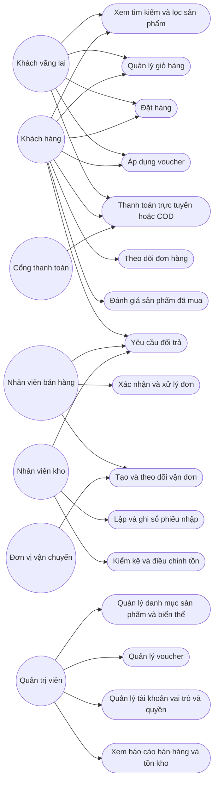

# Bổ sung phân tích và thiết kế cơ sở dữ liệu website shop quần áo

## 1. Mục tiêu tài liệu

Tài liệu này bổ sung cho thiết kế hiện có của cơ sở dữ liệu `WebQuanLyQuanAoDb`. Nội dung tập trung vào:

- Hoàn thiện use case theo quy trình vận hành thực tế của một shop quần áo.
- Sửa các điểm thiếu ràng buộc hoặc có thể gây sai dữ liệu trong 19 bảng hiện tại.
- Đề xuất các bảng còn thiếu cho tồn kho, thanh toán, lịch sử đơn hàng, voucher, đổi trả và hình ảnh sản phẩm.
- Quy định rõ trạng thái, công thức tiền, cách giữ tồn và thời điểm nhập/xuất kho.
- Đưa ra thứ tự triển khai để có thể cập nhật ERD và viết migration SQL Server.

Kết luận chính: mô hình hiện tại dùng được cho bản demo cơ bản, nhưng chưa đủ an toàn cho vận hành thực tế. Các phần cần ưu tiên là ràng buộc dữ liệu, sổ giao dịch kho, giữ tồn, thanh toán, lịch sử trạng thái và đổi trả.

## 2. Phạm vi và giả định nghiệp vụ

Hệ thống phục vụ một shop hoặc một kho trung tâm bán quần áo trực tuyến. Sản phẩm được quản lý theo biến thể size và màu. Khách có thể mua không cần tài khoản, thanh toán COD hoặc trực tuyến, sử dụng voucher, theo dõi đơn, đánh giá sản phẩm và yêu cầu đổi trả.

Các giả định được dùng trong thiết kế:

- Mỗi tổ hợp sản phẩm, size và màu tạo thành đúng một biến thể.
- Tồn kho được quản lý ở cấp biến thể, không quản lý trực tiếp ở cấp sản phẩm.
- Giá bán tại thời điểm mua phải được lưu lại trong chi tiết đơn hàng.
- Thông tin tên sản phẩm, SKU, size và màu trên đơn cũ không được thay đổi theo dữ liệu hiện tại.
- Đơn chưa hoàn tất có thể giữ tồn trong một khoảng thời gian.
- Chỉ phiếu nhập đã ghi sổ mới làm tăng tồn kho.
- Hủy đơn phải giải phóng phần tồn đã giữ; trả hàng chỉ nhập lại kho nếu hàng đủ điều kiện bán lại.
- Voucher chỉ được tính là đã sử dụng khi đạt trạng thái nghiệp vụ đã quy định; đơn thất bại hoặc bị hủy phải giải phóng lượt dùng.
- Các bản ghi lịch sử như đơn hàng, thanh toán, giao dịch kho và đổi trả không được xóa cứng.

## 3. Tác nhân của hệ thống

| Tác nhân | Trách nhiệm chính |
|---|---|
| Khách vãng lai | Xem sản phẩm, tìm kiếm, tạo giỏ bằng session, đặt hàng và thanh toán mà không cần tài khoản. |
| Khách hàng | Quản lý hồ sơ, địa chỉ, giỏ hàng, đơn hàng, voucher, đánh giá và yêu cầu đổi trả. |
| Nhân viên bán hàng | Xác nhận đơn, cập nhật đóng gói, giao hàng, hủy đơn theo quyền được cấp. |
| Nhân viên kho | Lập và ghi sổ phiếu nhập, kiểm kê, điều chỉnh tồn, xử lý hàng hoàn. |
| Quản trị viên | Quản lý người dùng, vai trò, quyền, sản phẩm, danh mục, voucher và báo cáo. |
| Cổng thanh toán | Tiếp nhận yêu cầu thanh toán và gửi kết quả qua callback hoặc webhook. |
| Đơn vị vận chuyển | Nhận thông tin giao hàng, cung cấp mã vận đơn và cập nhật trạng thái giao. |

## 4. Sơ đồ use case tổng quát



## 5. Danh sách use case thực tế

| Mã | Use case | Tác nhân chính | Kết quả mong đợi |
|---|---|---|---|
| UC01 | Đăng ký và đăng nhập | Khách hàng | Tài khoản được tạo hoặc phiên đăng nhập hợp lệ được cấp. |
| UC02 | Xem, tìm kiếm và lọc sản phẩm | Khách vãng lai, khách hàng | Trả về sản phẩm đang kinh doanh, đúng danh mục, giá, size, màu và tình trạng còn hàng. |
| UC03 | Xem chi tiết biến thể | Khách vãng lai, khách hàng | Hiển thị đúng SKU, ảnh, size, màu, giá và số lượng có thể bán. |
| UC04 | Quản lý giỏ hàng | Khách vãng lai, khách hàng | Mỗi biến thể chỉ có một dòng; số lượng luôn lớn hơn 0 và không vượt mức cho phép. |
| UC05 | Gộp giỏ sau đăng nhập | Khách hàng | Giỏ theo session được gộp an toàn vào giỏ tài khoản, không tạo dòng trùng biến thể. |
| UC06 | Áp dụng voucher | Khách vãng lai, khách hàng | Voucher hợp lệ được giữ lượt dùng và số tiền giảm được chốt vào đơn. |
| UC07 | Đặt hàng | Khách vãng lai, khách hàng | Đơn, chi tiết đơn, địa chỉ snapshot, giá snapshot và giữ tồn được tạo trong cùng giao dịch. |
| UC08 | Thanh toán trực tuyến | Khách hàng, cổng thanh toán | Mỗi lần thanh toán có bản ghi riêng, xử lý callback lặp không làm cộng tiền hai lần. |
| UC09 | Thanh toán COD | Khách hàng, nhân viên | Đơn được xác nhận theo chính sách COD và chỉ ghi nhận đã trả khi thu tiền thành công. |
| UC10 | Xác nhận và đóng gói đơn | Nhân viên bán hàng | Chuyển trạng thái hợp lệ, ghi lịch sử, trừ tồn và tiêu thụ phần giữ tồn đúng một lần. |
| UC11 | Giao hàng | Nhân viên, đơn vị vận chuyển | Lưu mã vận đơn, đơn vị vận chuyển, phí giao và các mốc giao hàng. |
| UC12 | Hủy đơn | Khách hàng hoặc nhân viên có quyền | Giải phóng giữ tồn, giải phóng voucher; nếu đã thanh toán thì khởi tạo hoàn tiền. |
| UC13 | Nhập hàng | Nhân viên kho | Phiếu nhập ở trạng thái nháp không đổi tồn; ghi sổ làm tăng tồn đúng một lần. |
| UC14 | Kiểm kê và điều chỉnh tồn | Nhân viên kho | Mọi chênh lệch được ghi thành giao dịch kho có người thực hiện và lý do. |
| UC15 | Đánh giá sản phẩm | Khách hàng | Chỉ người đã mua và đơn đã hoàn thành mới được đánh giá theo chính sách. |
| UC16 | Yêu cầu đổi trả | Khách hàng | Tạo yêu cầu theo từng dòng hàng, số lượng và lý do; không vượt số lượng đã mua. |
| UC17 | Nhận hàng hoàn và hoàn tiền | Nhân viên | Xác định hàng có nhập lại kho hay không và ghi nhận khoản hoàn tiền. |
| UC18 | Quản trị RBAC | Quản trị viên | Gán nhiều vai trò/quyền mà không tạo quan hệ trùng. |
| UC19 | Báo cáo doanh thu | Quản trị viên | Doanh thu chỉ tính từ giao dịch hợp lệ, trừ hoàn tiền và không tính đơn hủy. |
| UC20 | Báo cáo tồn kho | Quản trị viên, nhân viên kho | Xem tồn thực tế, tồn đang giữ và số lượng có thể bán theo từng biến thể. |

## 6. Luồng nghiệp vụ quan trọng

### 6.1. Đặt hàng và giữ tồn

1. Đọc giỏ hàng và tải các biến thể trong một transaction.
2. Kiểm tra sản phẩm và biến thể còn hoạt động.
3. Tính `AvailableQuantity = StockQuantity - ActiveReservedQuantity`.
4. Kiểm tra giá hiện tại, số lượng mua và điều kiện voucher.
5. Tạo `Orders` ở trạng thái phù hợp với phương thức thanh toán.
6. Tạo `OrderDetails` cùng dữ liệu snapshot.
7. Tạo `InventoryReservations` cho từng biến thể.
8. Tạo `CouponUsages` ở trạng thái `RESERVED` nếu có voucher.
9. Tạo `Payments` trạng thái `PENDING` nếu thanh toán trực tuyến.
10. Commit toàn bộ. Nếu bất kỳ bước nào lỗi thì rollback toàn bộ.

Việc kiểm tra và giữ tồn phải được thực hiện nguyên tử. Không được kiểm tra tồn ở một truy vấn rồi cập nhật ở một truy vấn không có khóa hoặc transaction, vì hai khách có thể cùng mua số hàng cuối cùng.

### 6.2. Xác nhận, xuất kho và hủy đơn

- Khi đơn được xác nhận hoặc chuyển sang đóng gói, hệ thống tạo giao dịch kho `SALE_OUT` với số lượng âm và chuyển giữ tồn sang `CONSUMED`.
- Một dòng đơn chỉ được tạo giao dịch xuất kho một lần. Cần `IdempotencyKey` hoặc unique index theo chứng từ nguồn.
- Nếu đơn bị hủy trước khi xuất kho, chuyển giữ tồn sang `RELEASED`.
- Nếu đơn bị hủy sau khi đã xuất kho, không cộng lại tồn trực tiếp; phải đi qua quy trình trả hàng hoặc giao dịch đảo `SALE_REVERSAL` có tham chiếu giao dịch gốc.
- Nếu đơn đã thanh toán, hủy đơn phải tạo yêu cầu hoàn tiền thay vì chỉ đổi `PaymentStatus` bằng tay.

### 6.3. Nhập kho

- `ImportReceipts` mới tạo có trạng thái `DRAFT`.
- Nhân viên có thể sửa chi tiết khi còn `DRAFT`.
- Khi `POSTED`, hệ thống tạo một `InventoryTransactions` loại `PURCHASE_IN` cho mỗi dòng nhập.
- Phiếu đã `POSTED` không được sửa chi tiết hoặc ghi sổ lần hai.
- Nếu cần hủy phiếu đã ghi sổ, tạo giao dịch đảo có dấu âm; không xóa lịch sử.

### 6.4. Voucher

- Voucher chỉ dùng một kiểu giảm: phần trăm hoặc số tiền cố định.
- Giảm phần trăm có thể có `MaxDiscountAmount`.
- Kiểm tra đồng thời thời gian hiệu lực, trạng thái, giá trị đơn tối thiểu, tổng giới hạn và giới hạn theo người dùng.
- Khi tạo đơn, giữ một lượt trong `CouponUsages`.
- Khi đơn đạt trạng thái quy định, chuyển lượt dùng sang `USED`.
- Khi đơn thất bại hoặc bị hủy, chuyển sang `RELEASED`.
- Không dùng `Coupons.UsedCount` làm nguồn dữ liệu duy nhất. Có thể giữ nó như bộ đếm cache, nhưng phải cập nhật cùng transaction và đối soát được từ `CouponUsages`.

### 6.5. Đổi trả

1. Khách chọn dòng hàng đã mua, số lượng, lý do và hình thức xử lý.
2. Hệ thống kiểm tra đơn đã hoàn thành, còn trong thời hạn đổi trả và tổng số lượng yêu cầu không vượt số lượng mua.
3. Nhân viên duyệt hoặc từ chối yêu cầu.
4. Khi nhận hàng, nhân viên đánh giá tình trạng từng món.
5. Hàng bán lại được tạo giao dịch `RETURN_IN`; hàng lỗi không được tự động cộng vào tồn bán được.
6. Nếu hoàn tiền, tạo hoặc cập nhật giao dịch hoàn tiền trong `Payments`.
7. Nếu đổi sang biến thể khác, tạo tham chiếu đến biến thể đổi và thực hiện xuất/nhập kho tương ứng.

## 7. Các thay đổi bắt buộc cho 19 bảng hiện có

### 7.1. `Roles`

- Giữ `RoleId`, `RoleName`, `Description`.
- `RoleName` phải unique và không rỗng.
- Có thể thêm `IsSystemRole` để ngăn xóa các vai trò hệ thống.

### 7.2. `Permissions`

- Giữ unique cho `PermissionCode`.
- Chuẩn hóa mã theo dạng `MODULE_ACTION`, ví dụ `PRODUCT_UPDATE`, `ORDER_APPROVE`.
- Nên thêm `IsActive` để ngừng sử dụng quyền mà không xóa dữ liệu.

### 7.3. `RolePermissions`

- Bắt buộc thêm `UNIQUE(RoleId, PermissionId)`.
- Có thể bỏ `RolePermissionId` và dùng khóa chính ghép `(RoleId, PermissionId)`.
- Cho phép cascade delete từ vai trò hoặc quyền nếu dữ liệu này chỉ là bảng liên kết.

### 7.4. `Users`

- Nếu dùng nhiều vai trò, bỏ `RoleId` sau khi chuyển dữ liệu sang `UserRoles`.
- `Username` unique, không rỗng.
- `Email` nên có filtered unique index khi khác `NULL`.
- `PasswordHash` phải lưu chuỗi hash từ thuật toán phù hợp; tuyệt đối không lưu mật khẩu thuần.
- `Address` bị trùng ý nghĩa với `CustomerAddresses`; nên bỏ hoặc chỉ dùng làm địa chỉ liên hệ không phục vụ giao hàng.
- Thêm `UpdatedAt`, `LastLoginAt`; có thể thêm `DeletedAt` nếu dùng soft delete.
- Không xóa cứng người dùng đã phát sinh đơn hàng hoặc chứng từ kho.

### 7.5. `CustomerAddresses`

- Bổ sung tỉnh/thành, quận/huyện, phường/xã hoặc mã địa giới tương ứng.
- Chỉ cho phép một địa chỉ mặc định trên mỗi người dùng bằng filtered unique index.
- Thêm `CreatedAt`, `UpdatedAt`, `IsActive`.

### 7.6. `Categories`

- `Slug` nên `NOT NULL` và unique nếu dùng làm URL.
- Có thể thêm `ParentCategoryId` tự tham chiếu nếu cần danh mục nhiều cấp.
- `DisplayOrder >= 0`.
- Không xóa danh mục đang có sản phẩm; sử dụng `IsActive`.

### 7.7. `Products`

- `ProductCode` nên `NOT NULL UNIQUE`; nếu vẫn cho phép rỗng thì dùng filtered unique index.
- `Price >= 0`.
- `DiscountPercent` cần `CHECK` từ 0 đến 100, nhưng nên tách chương trình giảm giá nếu cần thời gian hiệu lực hoặc nhiều chiến dịch.
- Phải quy định rõ thứ tự áp dụng giảm giá sản phẩm và voucher, hoặc không cho phép cộng dồn.
- `OriginalPrice` đang được mô tả là giá vốn/giá nhập, trong khi giá nhập đã nằm ở chi tiết phiếu nhập. Nên:
  - bỏ trường này; hoặc
  - đổi tên thành `StandardCost`/`AverageCost` và mô tả rõ cách cập nhật.
- Ảnh sản phẩm nên chuyển sang `ProductImages`; có thể giữ `MainImage` tạm thời để tương thích.
- Thêm `UpdatedAt`.

### 7.8. `Sizes`

- `SizeName` unique toàn hệ thống chỉ phù hợp khi mọi loại sản phẩm dùng chung chuẩn size.
- Nếu áo, quần, giày hoặc thương hiệu có bảng size khác nhau, thêm `SizeType` hoặc mô hình `SizeCharts` và `SizeChartItems`.
- Nếu shop chỉ bán quần áo theo chuẩn chung, mô hình hiện tại có thể giữ nguyên.

### 7.9. `Colors`

- `ColorName` unique.
- `ColorHex` cần kiểm tra định dạng `#RRGGBB` nếu có dữ liệu.

### 7.10. `ProductVariants`

- Bắt buộc `UNIQUE(ProductId, SizeId, ColorId)`.
- `SKU` nên `NOT NULL UNIQUE`; nếu rỗng thì dùng filtered unique index.
- `StockQuantity` có default 0 và `CHECK(StockQuantity >= 0)`.
- Thêm `IsActive`, `CreatedAt`, `UpdatedAt`.
- Nếu có phụ kiện không có size hoặc màu, dùng bản ghi chuẩn như `ONE_SIZE` và `DEFAULT`, hoặc thiết kế nullable có kiểm soát. Không để ứng dụng tự tạo nhiều tổ hợp rỗng trùng nhau.
- `StockQuantity` chỉ là số tồn hiện tại/cache; `InventoryTransactions` mới là nguồn truy vết.

### 7.11. `Carts`

- Bắt buộc có đúng một chủ sở hữu: `UserId` hoặc `SessionId`.
- Thêm `Status`: `ACTIVE`, `CONVERTED`, `ABANDONED`, `EXPIRED`.
- Thêm `ExpiresAt` cho giỏ khách vãng lai.
- Chỉ một giỏ `ACTIVE` cho mỗi người dùng hoặc session.
- Khi đăng nhập, gộp giỏ bằng transaction và cộng số lượng các dòng trùng biến thể.

### 7.12. `CartItems`

- Thêm `UNIQUE(CartId, VariantId)`.
- `Quantity > 0`.
- Thêm `UpdatedAt`.
- Không dùng giá lưu trong giỏ làm giá chốt; phải tính lại khi checkout.

### 7.13. `Coupons`

- Thay cặp trường giảm giá mơ hồ bằng `DiscountType` và `DiscountValue`, hoặc giữ trường cũ nhưng bắt buộc XOR.
- Thêm `MaxDiscountAmount` cho voucher phần trăm.
- `MinOrderAmount >= 0`.
- `EndDate > StartDate`.
- `UsageLimit > 0`, `UsedCount >= 0`, `UsedCount <= UsageLimit`.
- Thêm `UsageLimitPerUser`.
- Nếu voucher chỉ áp dụng cho một số sản phẩm/danh mục, bổ sung bảng liên kết tương ứng.
- Lượt sử dụng thực tế được theo dõi bằng `CouponUsages`.

### 7.14. `Orders`

- Thêm `OrderCode` unique để tra cứu và hiển thị ra ngoài; không lộ `OrderId` tuần tự.
- Giữ `UserId` nullable để hỗ trợ khách vãng lai.
- Lưu snapshot người nhận và địa chỉ là đúng; không nên chỉ tham chiếu địa chỉ hiện tại.
- Thêm `CustomerEmail` nếu cần gửi thông báo cho khách vãng lai.
- Tách rõ:
  - `Subtotal`: tổng tiền hàng trước voucher và phí giao.
  - `DiscountAmount`: số tiền giảm đã chốt.
  - `ShippingFee`: phí giao hàng.
  - `TaxAmount`: thuế nếu có.
  - `TotalAmount`: `Subtotal + ShippingFee + TaxAmount - DiscountAmount`.
- Thêm `CurrencyCode`, mặc định `VND`.
- Dùng mã trạng thái có kiểm soát thay cho chuỗi nhập tự do.
- Thêm `ApprovedByUserId`, `ApprovedAt`, `CancelledByUserId`, `CancelledAt`, `CancelReason`, `UpdatedAt`.
- Mọi lần đổi trạng thái phải ghi vào `OrderStatusHistory`.
- Thông tin thanh toán chi tiết chuyển sang `Payments`; có thể giữ `PaymentStatus` cache để truy vấn nhanh.
- Không xóa đơn hàng; sử dụng trạng thái nghiệp vụ.

### 7.15. `OrderDetails`

- Thêm `UNIQUE(OrderId, VariantId)` nếu mỗi biến thể chỉ xuất hiện một dòng trong đơn.
- `Quantity > 0`, `UnitPrice >= 0`.
- `TotalPrice` nên là computed column `Quantity * UnitPrice` hoặc được cập nhật trong cùng transaction.
- Bổ sung snapshot:
  - `ProductCodeSnapshot`
  - `ProductNameSnapshot`
  - `SKUSnapshot`
  - `SizeNameSnapshot`
  - `ColorNameSnapshot`
- Không cascade delete từ biến thể hoặc sản phẩm sang chi tiết đơn.

### 7.16. `ProductReviews`

- Thêm `OrderDetailId` để xác minh giao dịch mua.
- Chỉ cho đánh giá khi đơn đã hoàn thành.
- `Rating BETWEEN 1 AND 5`.
- Chọn chính sách unique phù hợp, ví dụ `UNIQUE(UserId, OrderDetailId)`.
- Thêm `UpdatedAt`, `ApprovedByUserId`, `ApprovedAt` nếu có kiểm duyệt.
- Không nên cho quản trị viên sửa nội dung đánh giá của khách; chỉ duyệt, ẩn hoặc phản hồi.

### 7.17. `Suppliers`

- Thêm `SupplierCode` unique và `IsActive`.
- Có thể thêm mã số thuế và người liên hệ nếu phục vụ nghiệp vụ mua hàng.
- Không xóa nhà cung cấp đã có phiếu nhập.

### 7.18. `ImportReceipts`

- Thêm `ImportCode` unique.
- Thêm `Status`: `DRAFT`, `POSTED`, `CANCELLED`.
- Thêm `CreatedAt`, `PostedAt`, `PostedByUserId`, `CancelledAt`.
- `TotalAmount >= 0`; nên tính từ chi tiết hoặc cập nhật trong cùng transaction.
- Chỉ trạng thái `POSTED` mới tạo giao dịch tăng kho.
- Phiếu đã `POSTED` không được ghi sổ lần hai.

### 7.19. `ImportReceiptDetails`

- Thêm `UNIQUE(ImportId, VariantId)` nếu mỗi biến thể chỉ có một dòng trong phiếu.
- `Quantity > 0`, `ImportPrice >= 0`.
- `TotalPrice` dùng computed column hoặc cập nhật trong cùng transaction.
- Mỗi dòng cần liên kết idempotent với một giao dịch `PURCHASE_IN` khi phiếu được ghi sổ.

## 8. Các bảng cần bổ sung

### 8.1. `UserRoles`

Chỉ cần bảng này nếu một người dùng có thể giữ nhiều vai trò.

| Trường | Kiểu dữ liệu | Null | Ý nghĩa |
|---|---|---:|---|
| UserId | INT, PK, FK | Không | Tham chiếu `Users`. |
| RoleId | INT, PK, FK | Không | Tham chiếu `Roles`. |
| AssignedAt | DATETIME2 | Không | Thời điểm gán vai trò. |
| AssignedByUserId | INT, FK | Có | Người thực hiện việc gán. |

Khóa chính ghép `(UserId, RoleId)` tự ngăn gán trùng.

### 8.2. `ProductImages`

| Trường | Kiểu dữ liệu | Null | Ý nghĩa |
|---|---|---:|---|
| ProductImageId | INT IDENTITY, PK | Không | Mã ảnh. |
| ProductId | INT, FK | Không | Sản phẩm sở hữu ảnh. |
| VariantId | INT, FK | Có | Biến thể cụ thể nếu ảnh chỉ áp dụng cho biến thể đó. |
| ImageUrl | VARCHAR(500) | Không | Đường dẫn ảnh. |
| AltText | NVARCHAR(200) | Có | Nội dung thay thế phục vụ khả năng truy cập và SEO. |
| DisplayOrder | INT | Không | Thứ tự hiển thị. |
| IsPrimary | BIT | Không | Ảnh chính trong phạm vi sản phẩm/biến thể. |
| IsActive | BIT | Không | Trạng thái sử dụng. |
| CreatedAt | DATETIME2 | Không | Thời điểm tạo. |

### 8.3. `InventoryTransactions`

Đây là bảng quan trọng nhất cần bổ sung để có sổ kho và khả năng đối soát.

| Trường | Kiểu dữ liệu | Null | Ý nghĩa |
|---|---|---:|---|
| InventoryTransactionId | BIGINT IDENTITY, PK | Không | Mã giao dịch kho. |
| VariantId | INT, FK | Không | Biến thể bị thay đổi tồn. |
| QuantityDelta | INT | Không | Số dương khi nhập, số âm khi xuất; không được bằng 0. |
| TransactionType | VARCHAR(30) | Không | `PURCHASE_IN`, `SALE_OUT`, `RETURN_IN`, `ADJUSTMENT`, `SALE_REVERSAL`... |
| SourceType | VARCHAR(30) | Không | Loại chứng từ nguồn như `IMPORT_DETAIL`, `ORDER_DETAIL`, `RETURN_ITEM`. |
| SourceId | BIGINT | Không | ID dòng chứng từ nguồn. |
| IdempotencyKey | VARCHAR(100), UNIQUE | Không | Ngăn cùng nghiệp vụ cập nhật kho nhiều lần. |
| CreatedByUserId | INT, FK | Có | Người thực hiện; có thể rỗng với thao tác hệ thống. |
| CreatedAt | DATETIME2 | Không | Thời điểm ghi sổ. |
| Note | NVARCHAR(500) | Có | Lý do hoặc ghi chú. |

Ràng buộc: `QuantityDelta <> 0`. Không cập nhật hoặc xóa giao dịch đã ghi; nếu sai phải tạo giao dịch đảo.

### 8.4. `InventoryReservations`

| Trường | Kiểu dữ liệu | Null | Ý nghĩa |
|---|---|---:|---|
| ReservationId | BIGINT IDENTITY, PK | Không | Mã giữ tồn. |
| OrderId | INT, FK | Không | Đơn đang giữ hàng. |
| VariantId | INT, FK | Không | Biến thể được giữ. |
| Quantity | INT | Không | Số lượng giữ, lớn hơn 0. |
| Status | VARCHAR(20) | Không | `ACTIVE`, `CONSUMED`, `RELEASED`, `EXPIRED`. |
| ExpiresAt | DATETIME2 | Có | Thời điểm tự hết hạn. |
| CreatedAt | DATETIME2 | Không | Thời điểm giữ tồn. |
| ReleasedAt | DATETIME2 | Có | Thời điểm giải phóng hoặc tiêu thụ. |

Thêm `UNIQUE(OrderId, VariantId)`. Số lượng có thể bán được tính bằng tồn thực tế trừ tổng reservation `ACTIVE`.

### 8.5. `CouponUsages`

| Trường | Kiểu dữ liệu | Null | Ý nghĩa |
|---|---|---:|---|
| CouponUsageId | BIGINT IDENTITY, PK | Không | Mã lượt dùng. |
| CouponId | INT, FK | Không | Voucher được sử dụng. |
| OrderId | INT, FK, UNIQUE | Không | Đơn sử dụng voucher. |
| UserId | INT, FK | Có | Người dùng; rỗng với khách vãng lai. |
| SessionId | VARCHAR(100) | Có | Nhận diện khách vãng lai nếu cần. |
| DiscountAmount | DECIMAL(18,2) | Không | Số tiền giảm thực tế đã chốt cho đơn. |
| Status | VARCHAR(20) | Không | `RESERVED`, `USED`, `RELEASED`. |
| ReservedAt | DATETIME2 | Không | Thời điểm giữ lượt. |
| UsedAt | DATETIME2 | Có | Thời điểm xác nhận sử dụng. |
| ReleasedAt | DATETIME2 | Có | Thời điểm giải phóng. |

### 8.6. `Payments`

| Trường | Kiểu dữ liệu | Null | Ý nghĩa |
|---|---|---:|---|
| PaymentId | BIGINT IDENTITY, PK | Không | Mã lần thanh toán. |
| OrderId | INT, FK | Không | Đơn được thanh toán. |
| PaymentMethod | VARCHAR(30) | Không | `COD`, `BANK_TRANSFER`, `VNPAY`, `MOMO`... |
| Amount | DECIMAL(18,2) | Không | Số tiền của giao dịch. |
| Status | VARCHAR(20) | Không | `PENDING`, `PAID`, `FAILED`, `CANCELLED`, `REFUNDED`, `PARTIALLY_REFUNDED`. |
| GatewayTransactionId | VARCHAR(100) | Có | Mã giao dịch từ cổng thanh toán. |
| IdempotencyKey | VARCHAR(100), UNIQUE | Không | Ngăn callback hoặc yêu cầu bị xử lý lặp. |
| RefundedAmount | DECIMAL(18,2) | Không | Tổng số tiền đã hoàn. |
| PaidAt | DATETIME2 | Có | Thời điểm thanh toán thành công. |
| CreatedAt | DATETIME2 | Không | Thời điểm tạo. |
| UpdatedAt | DATETIME2 | Không | Thời điểm cập nhật. |

Mỗi đơn có thể có nhiều lần thanh toán thất bại/thử lại nhưng tổng khoản `PAID` trừ hoàn tiền phải khớp với nghĩa vụ thanh toán của đơn.

### 8.7. `OrderStatusHistory`

| Trường | Kiểu dữ liệu | Null | Ý nghĩa |
|---|---|---:|---|
| OrderStatusHistoryId | BIGINT IDENTITY, PK | Không | Mã lịch sử. |
| OrderId | INT, FK | Không | Đơn được thay đổi. |
| FromStatus | VARCHAR(30) | Có | Trạng thái trước; rỗng khi tạo đơn. |
| ToStatus | VARCHAR(30) | Không | Trạng thái mới. |
| ChangedByUserId | INT, FK | Có | Người thay đổi; rỗng khi hệ thống tự động. |
| ChangedAt | DATETIME2 | Không | Thời điểm thay đổi. |
| Note | NVARCHAR(500) | Có | Lý do hoặc ghi chú. |

### 8.8. `Returns`

| Trường | Kiểu dữ liệu | Null | Ý nghĩa |
|---|---|---:|---|
| ReturnId | INT IDENTITY, PK | Không | Mã yêu cầu đổi trả. |
| ReturnCode | VARCHAR(30), UNIQUE | Không | Mã hiển thị cho khách. |
| OrderId | INT, FK | Không | Đơn gốc. |
| UserId | INT, FK | Có | Khách yêu cầu; có thể rỗng với đơn khách vãng lai. |
| Reason | NVARCHAR(500) | Không | Lý do tổng quát. |
| Status | VARCHAR(30) | Không | `REQUESTED`, `APPROVED`, `REJECTED`, `RECEIVED`, `REFUNDING`, `COMPLETED`, `CANCELLED`. |
| RequestedAt | DATETIME2 | Không | Thời điểm yêu cầu. |
| ApprovedByUserId | INT, FK | Có | Người duyệt. |
| ApprovedAt | DATETIME2 | Có | Thời điểm duyệt. |
| ReceivedAt | DATETIME2 | Có | Thời điểm shop nhận hàng. |
| CompletedAt | DATETIME2 | Có | Thời điểm hoàn tất. |
| RefundAmount | DECIMAL(18,2) | Không | Tổng tiền hoàn. |

### 8.9. `ReturnItems`

| Trường | Kiểu dữ liệu | Null | Ý nghĩa |
|---|---|---:|---|
| ReturnItemId | INT IDENTITY, PK | Không | Mã dòng đổi trả. |
| ReturnId | INT, FK | Không | Yêu cầu đổi trả. |
| OrderDetailId | INT, FK | Không | Dòng hàng gốc. |
| Quantity | INT | Không | Số lượng đổi/trả, lớn hơn 0. |
| Resolution | VARCHAR(20) | Không | `REFUND`, `EXCHANGE`, `STORE_CREDIT`. |
| ExchangeVariantId | INT, FK | Có | Biến thể nhận thay nếu đổi hàng. |
| ItemCondition | VARCHAR(30) | Có | `RESELLABLE`, `DAMAGED`, `USED`, `DEFECTIVE`. |
| RestockQuantity | INT | Không | Số lượng đủ điều kiện nhập lại kho. |
| RefundAmount | DECIMAL(18,2) | Không | Số tiền hoàn của dòng. |
| Note | NVARCHAR(500) | Có | Ghi chú xử lý. |

Tổng số lượng đã đổi/trả của một `OrderDetailId` không được vượt `OrderDetails.Quantity`.

### 8.10. `Shipments` khuyến nghị

Bảng này nên thêm khi cần tích hợp đơn vị vận chuyển hoặc một đơn có thể giao nhiều kiện.

| Trường | Kiểu dữ liệu | Null | Ý nghĩa |
|---|---|---:|---|
| ShipmentId | BIGINT IDENTITY, PK | Không | Mã vận chuyển. |
| OrderId | INT, FK | Không | Đơn hàng. |
| ProviderCode | VARCHAR(30) | Có | Mã đơn vị vận chuyển. |
| TrackingCode | VARCHAR(100) | Có | Mã vận đơn. |
| ShippingFee | DECIMAL(18,2) | Không | Phí giao hàng. |
| Status | VARCHAR(30) | Không | Trạng thái vận chuyển. |
| ShippedAt | DATETIME2 | Có | Thời điểm giao cho đơn vị vận chuyển. |
| DeliveredAt | DATETIME2 | Có | Thời điểm giao thành công. |
| UpdatedAt | DATETIME2 | Không | Lần cập nhật cuối. |

## 9. ERD đề xuất ở mức quan hệ

```mermaid
erDiagram
    ROLES ||--o{ ROLE_PERMISSIONS : grants
    PERMISSIONS ||--o{ ROLE_PERMISSIONS : includes
    USERS ||--o{ USER_ROLES : assigned
    ROLES ||--o{ USER_ROLES : contains
    USERS ||--o{ CUSTOMER_ADDRESSES : owns

    CATEGORIES ||--o{ PRODUCTS : classifies
    PRODUCTS ||--o{ PRODUCT_VARIANTS : has
    SIZES ||--o{ PRODUCT_VARIANTS : sizes
    COLORS ||--o{ PRODUCT_VARIANTS : colors
    PRODUCTS ||--o{ PRODUCT_IMAGES : has
    PRODUCT_VARIANTS ||--o{ PRODUCT_IMAGES : optionally_has

    USERS ||--o{ CARTS : owns
    CARTS ||--o{ CART_ITEMS : contains
    PRODUCT_VARIANTS ||--o{ CART_ITEMS : selected

    USERS ||--o{ ORDERS : places
    COUPONS ||--o{ ORDERS : applied_to
    ORDERS ||--|{ ORDER_DETAILS : contains
    PRODUCT_VARIANTS ||--o{ ORDER_DETAILS : ordered_as
    ORDERS ||--o{ PAYMENTS : paid_by
    ORDERS ||--o{ ORDER_STATUS_HISTORY : changes
    ORDERS ||--o{ INVENTORY_RESERVATIONS : reserves
    PRODUCT_VARIANTS ||--o{ INVENTORY_RESERVATIONS : reserved_variant
    COUPONS ||--o{ COUPON_USAGES : used
    ORDERS ||--o| COUPON_USAGES : records
    ORDERS ||--o{ SHIPMENTS : ships

    SUPPLIERS ||--o{ IMPORT_RECEIPTS : supplies
    USERS ||--o{ IMPORT_RECEIPTS : creates
    IMPORT_RECEIPTS ||--|{ IMPORT_RECEIPT_DETAILS : contains
    PRODUCT_VARIANTS ||--o{ IMPORT_RECEIPT_DETAILS : received
    PRODUCT_VARIANTS ||--o{ INVENTORY_TRANSACTIONS : moves

    ORDER_DETAILS ||--o{ PRODUCT_REVIEWS : verifies
    USERS ||--o{ PRODUCT_REVIEWS : writes

    ORDERS ||--o{ RETURNS : may_have
    RETURNS ||--|{ RETURN_ITEMS : contains
    ORDER_DETAILS ||--o{ RETURN_ITEMS : returned_from
    PRODUCT_VARIANTS ||--o{ RETURN_ITEMS : exchanged_to
```



## 10. Bộ trạng thái đề xuất

### 10.1. Trạng thái đơn hàng

| Trạng thái | Ý nghĩa | Có thể chuyển tiếp tới |
|---|---|---|
| `PENDING_PAYMENT` | Chờ thanh toán trực tuyến | `PENDING_CONFIRMATION`, `PAYMENT_FAILED`, `CANCELLED` |
| `PAYMENT_FAILED` | Thanh toán thất bại | `PENDING_PAYMENT`, `CANCELLED` |
| `PENDING_CONFIRMATION` | Chờ shop xác nhận | `CONFIRMED`, `CANCELLED` |
| `CONFIRMED` | Đơn đã được chấp nhận | `PACKING`, `CANCELLED` |
| `PACKING` | Đang chuẩn bị hàng | `SHIPPING`, `CANCELLED` theo chính sách |
| `SHIPPING` | Đang giao | `COMPLETED`, `DELIVERY_FAILED`, `RETURNING` |
| `DELIVERY_FAILED` | Giao thất bại | `SHIPPING`, `RETURNING`, `CANCELLED` |
| `COMPLETED` | Giao và thanh toán hoàn tất | `RETURN_REQUESTED` |
| `RETURN_REQUESTED` | Có yêu cầu đổi trả | `COMPLETED`, `RETURNING`, `RETURNED` |
| `RETURNING` | Hàng đang quay về shop | `RETURNED` |
| `RETURNED` | Đã nhận và xử lý hàng trả | Kết thúc |
| `CANCELLED` | Đơn bị hủy | Kết thúc |

Không cho phép cập nhật trạng thái tùy ý. Việc chuyển trạng thái phải đi qua hàm dịch vụ kiểm tra ma trận chuyển tiếp và ghi `OrderStatusHistory`.

### 10.2. Trạng thái phiếu nhập

- `DRAFT`: được phép sửa.
- `POSTED`: đã ghi sổ và tăng tồn; không được sửa dòng.
- `CANCELLED`: bị hủy. Nếu trước đó đã ghi sổ thì phải có giao dịch đảo.

### 10.3. Trạng thái giữ tồn

- `ACTIVE`: đang giữ hàng.
- `CONSUMED`: đã chuyển thành xuất bán.
- `RELEASED`: đã giải phóng do hủy hoặc thất bại.
- `EXPIRED`: hết thời gian thanh toán.

## 11. Công thức và quy tắc dữ liệu

### 11.1. Tiền đơn hàng

```text
LineTotal = Quantity * UnitPrice
Subtotal = SUM(LineTotal)
TotalAmount = Subtotal + ShippingFee + TaxAmount - DiscountAmount
```

Ràng buộc:

- Mọi giá trị tiền phải lớn hơn hoặc bằng 0.
- `DiscountAmount <= Subtotal` trừ khi chính sách cho phép voucher giảm phí giao.
- `TotalAmount >= 0`.
- Giá và số tiền giảm trên đơn là snapshot, không tính lại từ dữ liệu voucher sau khi đơn được tạo.

### 11.2. Tồn kho

```text
StockOnHand = SUM(InventoryTransactions.QuantityDelta)
ReservedQuantity = SUM(InventoryReservations.Quantity WHERE Status = 'ACTIVE')
AvailableQuantity = StockOnHand - ReservedQuantity
```

Nếu giữ `ProductVariants.StockQuantity` để truy vấn nhanh thì trường này phải bằng `StockOnHand` và được cập nhật cùng transaction với `InventoryTransactions`.

### 11.3. Doanh thu

Doanh thu không nên cộng trực tiếp mọi `Orders.TotalAmount`. Chỉ tính đơn đạt trạng thái được ghi nhận doanh thu, sau đó trừ số tiền hoàn. Cần thống nhất báo cáo theo:

- ngày đặt hàng;
- ngày thanh toán;
- hoặc ngày hoàn thành đơn.

Khuyến nghị báo cáo tài chính theo ngày thanh toán/hoàn tiền, còn báo cáo bán hàng có thể theo ngày hoàn thành.

## 12. Ràng buộc SQL Server quan trọng

```sql
CREATE UNIQUE INDEX UX_RolePermissions_Role_Permission
ON RolePermissions(RoleId, PermissionId);

CREATE UNIQUE INDEX UX_ProductVariants_Product_Size_Color
ON ProductVariants(ProductId, SizeId, ColorId);

CREATE UNIQUE INDEX UX_CartItems_Cart_Variant
ON CartItems(CartId, VariantId);

CREATE UNIQUE INDEX UX_ImportReceiptDetails_Import_Variant
ON ImportReceiptDetails(ImportId, VariantId);

CREATE UNIQUE INDEX UX_Products_ProductCode_NotNull
ON Products(ProductCode)
WHERE ProductCode IS NOT NULL;

CREATE UNIQUE INDEX UX_ProductVariants_SKU_NotNull
ON ProductVariants(SKU)
WHERE SKU IS NOT NULL;

CREATE UNIQUE INDEX UX_Users_Email_NotNull
ON Users(Email)
WHERE Email IS NOT NULL;

CREATE UNIQUE INDEX UX_CustomerAddresses_OneDefault
ON CustomerAddresses(UserId)
WHERE IsDefault = 1;

ALTER TABLE ProductVariants ADD CONSTRAINT CK_ProductVariants_Stock
CHECK (StockQuantity >= 0);

ALTER TABLE CartItems ADD CONSTRAINT CK_CartItems_Quantity
CHECK (Quantity > 0);

ALTER TABLE OrderDetails ADD CONSTRAINT CK_OrderDetails_Values
CHECK (Quantity > 0 AND UnitPrice >= 0 AND TotalPrice >= 0);

ALTER TABLE ProductReviews ADD CONSTRAINT CK_ProductReviews_Rating
CHECK (Rating BETWEEN 1 AND 5);

ALTER TABLE Carts ADD CONSTRAINT CK_Carts_Owner
CHECK (
    (UserId IS NOT NULL AND SessionId IS NULL)
 OR (UserId IS NULL AND SessionId IS NOT NULL)
);

ALTER TABLE Coupons ADD CONSTRAINT CK_Coupons_DiscountMode
CHECK (
    (DiscountPercent IS NOT NULL AND DiscountAmount IS NULL
     AND DiscountPercent BETWEEN 1 AND 100)
 OR (DiscountPercent IS NULL AND DiscountAmount IS NOT NULL
     AND DiscountAmount > 0)
);

ALTER TABLE Coupons ADD CONSTRAINT CK_Coupons_Dates
CHECK (EndDate > StartDate);

ALTER TABLE InventoryTransactions ADD CONSTRAINT CK_InventoryTransactions_Delta
CHECK (QuantityDelta <> 0);
```

Tên bảng và cột trong migration thực tế phải được điều chỉnh nếu quyết định đổi sang `DiscountType`/`DiscountValue` hoặc loại bỏ các cột cũ.

## 13. Index cần thiết

Ngoài unique index, nên tạo index cho:

- Mọi khóa ngoại thường xuyên join.
- `Products(CategoryId, IsActive)`.
- `ProductVariants(ProductId, IsActive)` và `ProductVariants(SKU)`.
- `Orders(UserId, OrderDate DESC)`.
- `Orders(OrderStatus, OrderDate)`.
- `Orders(OrderCode)` unique.
- `OrderDetails(OrderId)`.
- `Payments(OrderId, Status)` và filtered unique cho mã giao dịch cổng thanh toán khi khác `NULL`.
- `InventoryTransactions(VariantId, CreatedAt)`.
- `InventoryReservations(VariantId, Status, ExpiresAt)`.
- `CouponUsages(CouponId, Status)` và `CouponUsages(UserId, CouponId, Status)`.
- `OrderStatusHistory(OrderId, ChangedAt)`.
- `Returns(OrderId, Status)`.
- `ProductReviews(ProductId, IsApproved, CreatedAt)`.

Không tạo index cho mọi cột một cách máy móc; cần kiểm tra truy vấn thực tế và execution plan.

## 14. Chính sách khóa ngoại và xóa dữ liệu

| Quan hệ | Chính sách khuyến nghị |
|---|---|
| `Carts` -> `CartItems` | Có thể cascade delete nếu giỏ chưa chuyển thành đơn và không cần lưu lịch sử. |
| `Roles`/`Permissions` -> `RolePermissions` | Có thể cascade trên bảng liên kết. |
| `Orders` -> `OrderDetails`, `Payments`, `History` | `NO ACTION`; không xóa cứng đơn hàng. |
| `Products`/`Variants` -> `OrderDetails` | `NO ACTION`; dùng `IsActive` để ngừng bán. |
| `ImportReceipts` -> chi tiết/giao dịch kho | `NO ACTION` sau khi ghi sổ. |
| `Returns` -> `ReturnItems` | `NO ACTION` khi đã xử lý nghiệp vụ. |
| `Users` -> đơn hàng/chứng từ | `NO ACTION`; khóa tài khoản hoặc ẩn dữ liệu cá nhân theo chính sách thay vì xóa lịch sử. |

## 15. Quy tắc transaction và chống xử lý lặp

- Checkout, giữ tồn và giữ lượt voucher phải nằm trong cùng transaction.
- Ghi sổ phiếu nhập và tạo giao dịch tăng kho phải nằm trong cùng transaction.
- Chuyển giữ tồn sang xuất kho phải nằm trong cùng transaction.
- Callback thanh toán phải dùng `IdempotencyKey` hoặc `GatewayTransactionId` để xử lý lặp an toàn.
- Ghi sổ tồn phải có khóa hoặc câu lệnh cập nhật có điều kiện để không tạo tồn âm.
- Các thao tác nhạy cảm nên dùng optimistic concurrency qua `rowversion` hoặc kiểm tra phiên bản dữ liệu.
- Tổng tiền ở header và detail nếu cùng tồn tại phải được cập nhật trong một service/transaction duy nhất.

## 16. Các điểm chưa thật sự đạt 3NF

Các trường sau là dữ liệu dẫn xuất hoặc cache:

- `OrderDetails.TotalPrice`.
- `Orders.Subtotal` và `Orders.TotalAmount`.
- `ImportReceiptDetails.TotalPrice`.
- `ImportReceipts.TotalAmount`.
- `Coupons.UsedCount`.
- `ProductVariants.StockQuantity`.

Việc lưu các trường này không nhất thiết sai nếu mục tiêu là hiệu năng và lưu snapshot nghiệp vụ. Tuy nhiên, không nên tuyên bố mô hình thuần 3NF mà không giải thích cơ chế đồng bộ. Nên ghi rõ đây là các trường phi chuẩn hóa có chủ đích và được bảo vệ bằng computed column, transaction hoặc quy trình đối soát.

## 17. Yêu cầu bảo mật và kiểm toán

- Mật khẩu phải được hash bằng thư viện chuẩn, có salt; không tự viết thuật toán mã hóa.
- Không ghi đầy đủ dữ liệu nhạy cảm của cổng thanh toán vào log.
- Ghi `CreatedBy`, `UpdatedBy` hoặc bảng audit cho thao tác duyệt đơn, điều chỉnh kho, thay đổi voucher và phân quyền.
- Phân quyền phải kiểm tra ở backend; ẩn nút trên giao diện không phải là kiểm soát bảo mật.
- Các API đổi trạng thái đơn, ghi sổ kho, hoàn tiền và gán quyền cần chống gửi lặp.
- Không cho sửa/xóa trực tiếp giao dịch kho, thanh toán hoặc lịch sử trạng thái sau khi đã ghi nhận.

## 18. Thứ tự triển khai đề xuất

### Giai đoạn 1: Sửa toàn vẹn dữ liệu

1. Sao lưu CSDL và kiểm tra dữ liệu trùng hiện có.
2. Dọn các biến thể trùng `(ProductId, SizeId, ColorId)`.
3. Dọn dòng giỏ, quyền và chi tiết nhập trùng.
4. Quyết định cách xử lý `ProductCode`/`SKU` rỗng.
5. Thêm `CHECK`, unique index, filtered unique index và index khóa ngoại.
6. Đổi các cột thời gian mới sang `DATETIME2` và thêm default.

### Giai đoạn 2: Hoàn thiện đơn hàng và thanh toán

1. Mở rộng `Orders` và snapshot trong `OrderDetails`.
2. Thêm `Payments` và `OrderStatusHistory`.
3. Chuyển logic trạng thái sang service có ma trận chuyển tiếp.
4. Bổ sung `OrderCode`, idempotency và xử lý callback thanh toán.

### Giai đoạn 3: Hoàn thiện kho

1. Thêm `InventoryTransactions` và `InventoryReservations`.
2. Khởi tạo số dư đầu kỳ từ `ProductVariants.StockQuantity` bằng giao dịch `OPENING_BALANCE`.
3. Sửa quy trình nhập để chỉ phiếu `POSTED` tăng tồn.
4. Sửa checkout để giữ tồn nguyên tử.
5. Thêm job giải phóng reservation hết hạn.
6. Đối soát `StockQuantity` với tổng sổ kho.

### Giai đoạn 4: Voucher, đánh giá và đổi trả

1. Thêm `CouponUsages` và chuyển logic giới hạn sử dụng sang bảng này.
2. Liên kết review với `OrderDetailId`.
3. Thêm `Returns`, `ReturnItems` và luồng hoàn tiền/nhập lại kho.
4. Thêm `Shipments` nếu tích hợp đơn vị vận chuyển.

### Giai đoạn 5: Hoàn thiện báo cáo và tài liệu

1. Vẽ lại ERD có đầy đủ cardinality, PK, FK và unique constraint.
2. Vẽ Use Case theo các tác nhân và use case trong tài liệu này.
3. Bổ sung sequence diagram cho checkout, thanh toán callback, ghi sổ nhập và đổi trả.
4. Viết test cho concurrent checkout, callback lặp, hủy đơn và ghi sổ phiếu nhập hai lần.
5. Kiểm tra báo cáo doanh thu khi có hủy đơn và hoàn tiền.

## 19. Tiêu chí nghiệm thu

- Không thể tạo hai biến thể cùng sản phẩm, size và màu.
- Không thể tạo giỏ không có chủ hoặc có đồng thời `UserId` và `SessionId`.
- Không thể có hai dòng cùng biến thể trong một giỏ hoặc đơn theo chính sách đã chọn.
- Không thể áp voucher không có kiểu giảm hợp lệ hoặc ngoài thời gian hiệu lực.
- Hai khách mua đồng thời không làm `AvailableQuantity` âm.
- Callback thanh toán gửi nhiều lần chỉ ghi nhận một kết quả tài chính.
- Ghi sổ một phiếu nhập hai lần không làm tăng tồn hai lần.
- Hủy đơn giải phóng đúng tồn và voucher.
- Đơn cũ vẫn hiển thị đúng tên sản phẩm, SKU, size, màu và giá tại thời điểm mua.
- Khách không mua hàng không thể tạo đánh giá được xác minh.
- Tổng số lượng đổi/trả không vượt số lượng đã mua.
- Báo cáo doanh thu loại trừ đơn hủy và trừ số tiền đã hoàn.
- Có thể truy vết mọi thay đổi tồn kho về chứng từ nguồn và người thực hiện.

## 20. Kết quả thiết kế sau khi bổ sung

Sau khi hoàn thành các giai đoạn trên, hệ thống sẽ có:

- RBAC không tạo quan hệ trùng và có thể hỗ trợ nhiều vai trò.
- Danh mục, sản phẩm, biến thể và hình ảnh được quản lý rõ ràng.
- Giỏ hàng cho khách vãng lai và khách đăng nhập có quy tắc sở hữu nhất quán.
- Đơn hàng giữ được dữ liệu lịch sử, có trạng thái và nhật ký thay đổi.
- Thanh toán hỗ trợ thử lại, callback, hoàn tiền và chống xử lý lặp.
- Voucher có thể kiểm soát giới hạn chính xác trong điều kiện đồng thời.
- Kho hàng có sổ giao dịch, giữ tồn, nhập/xuất/đảo giao dịch và khả năng đối soát.
- Nghiệp vụ đổi size, đổi màu, trả hàng và nhập lại kho được phản ánh đầy đủ.
- Báo cáo doanh thu và tồn kho có nguồn dữ liệu đáng tin cậy hơn.

Tài liệu này là cơ sở để cập nhật ERD, viết migration SQL Server và sửa các service nghiệp vụ. Khi triển khai, nên ưu tiên tính đúng và khả năng truy vết trước các tối ưu hiệu năng.
